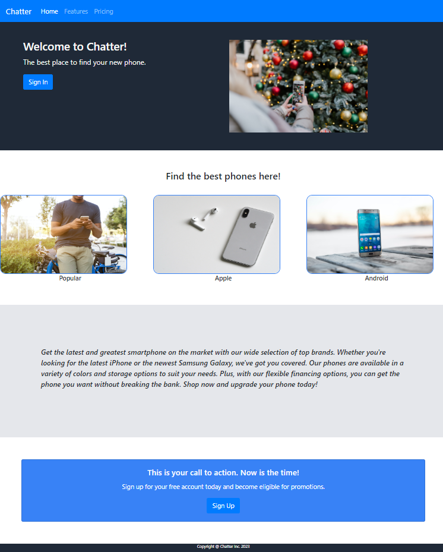

# Learning-Web-Development---Odin-Project

This webpage was the second project of the Odin Project. This project was meant as a review to reinforce key learing in CSS, HTML, Flexbox, and Git.

More information can be found here: https://www.theodinproject.com/lessons/foundations-landing-page

